# MVP · Engenharia de Dados — a promessa de entrega da Olist

**Antônio V.** · Pós-graduação em Ciência de Dados e Analytics — PUC-Rio
Sprint: Engenharia de Dados · Entrega: 27/09/2026
Plataforma: **Databricks Free Edition** (Unity Catalog + Delta Lake + Apache Spark)

---

## Sumário

| Tópico da especificação | Seção |
|---|---|
| Contexto de Negócio e Perguntas (Etapas 2 e 4.1) | [1](#1-contexto-de-negócio-e-perguntas-etapas-2-e-41) |
| Carga dos Dados (Etapa 4.2) | [2](#2-carga-dos-dados-etapa-42) |
| Modelagem e Catálogo de Dados (Etapa 4.3) | [3](#3-modelagem-e-catálogo-de-dados-etapa-43) |
| Pipeline de Dados (Etapa 4.4) | [4](#4-pipeline-de-dados-etapa-44) |
| Qualidade de Dados (Etapa 4.5) | [5](#5-qualidade-de-dados-etapa-45) |
| Análise de Dados (Etapa 4.5) | [6](#6-análise-de-dados-etapa-45) |
| Autoavaliação | [7](#7-autoavaliação) |

**Execução:** todo o pipeline foi executado no Databricks Free Edition, no catálogo Unity Catalog
`olist_mvp` (schemas `bronze`, `silver`, `gold`). Os screenshots de evidência estão distribuídos ao
longo das seções correspondentes e reunidos em `docs/img/`.

**Estrutura do repositório**

```
notebooks/   00 setup · 01 bronze · 02 qualidade · 03 silver
             04 gold · 05 testes pós-carga · 06 análise · 07 catálogo
sql/         as mesmas consultas de análise em SQL puro
docs/        catálogo de dados gerado + gráficos + evidências de execução
```

---

## 1. Contexto de Negócio e Perguntas (Etapas 2 e 4.1)

### 1.1 O problema

A [Olist](https://olist.com/) é um marketplace brasileiro: ela não vende, ela conecta. Milhares de
lojistas independentes, espalhados pelo país, vendem através dela para compradores que podem estar
a 3.000 km de distância. A Olist não controla o estoque nem dirige o caminhão — mas é o nome dela
que aparece na avaliação de uma estrela.

Isso põe a empresa numa posição peculiar: **tudo que ela realmente controla é uma promessa.** No
checkout, o cliente vê uma data estimada de entrega. Essa promessa é a variável de gestão; o resto
(o lojista embalar a tempo, a transportadora cruzar o país) é execução distribuída que ela apenas
influencia. Duas perguntas de gestão saem daí:

1. **Quanto custa quebrar a promessa?** Se atrasar tem pouco efeito sobre a satisfação, a Olist
   pode prometer prazos agressivos e ganhar conversão. Se tem muito efeito, o prazo precisa ser
   conservador — mas prazo conservador afasta cliente na hora da compra. É um trade-off que só se
   resolve com número.
2. **O que faz o frete ser caro?** O frete no Brasil é uma função da geografia, e a geografia do
   marketplace não é escolha do cliente: ele compra de quem está no catálogo. Se o custo do frete
   for majoritariamente distância, a alavanca é distribuir vendedores; se for peso e volume, a
   alavanca é embalagem e mix de produto.

Traduzindo para o que um time de dados precisa entregar: um modelo que ligue, no mesmo lugar,
**o prazo prometido, o prazo realizado, a nota do cliente, o valor do frete e a geografia de quem
vendeu e de quem comprou** — que na origem estão espalhados por nove arquivos distintos.

### 1.2 As perguntas de negócio

| # | Pergunta | Por que importa |
|---|---|---|
| **P1** | Qual a relação entre atraso na entrega e a nota da avaliação? Existe um limiar a partir do qual a insatisfação dispara? | Define o custo de quebrar a promessa |
| **P2** | Em qual etapa do ciclo (aprovação → postagem → transporte) o tempo é perdido? O que separa um pedido pontual de um atrasado? | Aponta onde agir: no lojista ou na logística |
| **P3** | O prazo prometido ao cliente é sistematicamente conservador? Quantos dias de folga a Olist embute? | Mede o espaço para prometer prazos melhores |
| **P4** | O desempenho de entrega e a satisfação são iguais em todo o país? | Identifica onde a operação falha |
| **P5** | O que explica o custo do frete — distância, peso ou valor do produto? Quanto do que o cliente paga é frete? | Define a alavanca de redução de custo |
| **P6** | Quais categorias concentram receita e quais concentram insatisfação? Existe categoria que vende muito e entrega mal? | Prioriza esforço por linha de produto |
| **P7** | Quão concentrada é a receita entre os vendedores? | Mede o risco de dependência de poucos lojistas |
| **P8** | Meio de pagamento e parcelamento têm relação com o tamanho do pedido? | Informa política de crédito e checkout |
| **P9** | O cliente que sofreu atraso volta a comprar? | Liga qualidade de entrega a receita futura |

> Conforme a especificação, as perguntas permanecem aqui **exatamente como foram formuladas antes
> da coleta**. A P9 acabou só parcialmente respondível; a discussão está na
> [autoavaliação](#7-autoavaliação).

### 1.3 Os dados brutos

**Fonte:** *Brazilian E-Commerce Public Dataset by Olist* — 100 mil pedidos reais feitos entre
**setembro de 2016 e outubro de 2018** em marketplaces brasileiros, publicados pela própria Olist.
Os dados foram anonimizados pela empresa: nomes de clientes e vendedores foram substituídos por
identificadores hash e as referências comerciais nos comentários, por nomes de casas de *Game of
Thrones*.

**Licença:** **CC BY-NC-SA 4.0** (Creative Commons Atribuição · Não Comercial · Compartilha Igual).
Permite uso, adaptação e redistribuição para fins **acadêmicos e não comerciais**, exigindo
atribuição à Olist e manutenção da mesma licença em trabalhos derivados. Este MVP é um trabalho
acadêmico sem fim comercial, publicado sob a mesma licença — portanto, dentro dos termos.
O dataset é publicado no Kaggle:
[olistbr/brazilian-ecommerce](https://www.kaggle.com/datasets/olistbr/brazilian-ecommerce).

**Estrutura:** nove arquivos CSV, **1.551.698 linhas**, num modelo relacional normalizado:

| Arquivo | Linhas | Grão | Principais colunas |
|---|---:|---|---|
| `olist_orders_dataset.csv` | 99.441 | pedido | `order_id`, `customer_id`, `order_status`, 4 timestamps do ciclo + prazo estimado |
| `olist_order_items_dataset.csv` | 112.650 | item do pedido | `order_id`, `order_item_id`, `product_id`, `seller_id`, `price`, `freight_value` |
| `olist_order_payments_dataset.csv` | 103.886 | transação de pagamento | `payment_type`, `payment_installments`, `payment_value` |
| `olist_order_reviews_dataset.csv` | 100.000 | avaliação | `review_id`, `order_id`, `review_score` (1–5), comentário livre |
| `olist_customers_dataset.csv` | 99.441 | cliente por compra | `customer_id`, `customer_unique_id`, CEP, cidade, UF |
| `olist_sellers_dataset.csv` | 3.095 | vendedor | `seller_id`, CEP, cidade, UF |
| `olist_products_dataset.csv` | 32.951 | produto | categoria, peso, dimensões, nº de fotos |
| `olist_geolocation_dataset.csv` | 1.000.163 | observação de GPS | prefixo de CEP, latitude, longitude |
| `product_category_name_translation.csv` | 71 | categoria | tradução pt → en |

Três detalhes do modelo de origem que condicionam todo o resto do trabalho:

- **`customer_id` não identifica uma pessoa.** Ele identifica o cliente *naquela compra* e muda a
  cada pedido. Quem identifica a pessoa é `customer_unique_id`. Trocar um pelo outro faz a taxa de
  recompra virar zero — e é um erro fácil de cometer.
- **`geolocation` não é uma tabela de lugares, é de observações.** São 1 milhão de pontos de GPS
  para 19 mil CEPs. Usar direto num join multiplica as linhas do fato por ~50.
- **O prazo prometido está na tabela de pedidos** (`order_estimated_delivery_date`), o que torna
  possível medir a promessa contra a realidade — o eixo central deste MVP.

---

## 2. Carga dos Dados (Etapa 4.2)

> Script: [`notebooks/01_ingestao_bronze.py`](notebooks/01_ingestao_bronze.py)

### 2.1 Como a coleta foi feita

A coleta roda **dentro da nuvem**, não na máquina local. O notebook `01_ingestao_bronze` executa,
no cluster Databricks, o download dos nove CSVs direto para o Volume do Unity Catalog
`olist_mvp.bronze.landing`, via `urllib.request`. Nenhum arquivo passa pelo computador de quem
executa; nenhum upload manual é necessário. Quem clonar este repositório e rodar o notebook
reproduz a base inteira do zero.

```python
for chave, (arquivo, _tabela, _opcoes) in ARQUIVOS_FONTE.items():
    destino = f"{LANDING}/{arquivo}"
    if os.path.exists(destino) and os.path.getsize(destino) > 0:
        print(f"· {arquivo}: já presente, download ignorado")
        continue
    urllib.request.urlretrieve(f"{FONTE_BASE_URL}/{arquivo}", destino)
```

A ingestão é **idempotente** nas duas pontas: arquivo já presente não é rebaixado, e as tabelas são
sobrescritas (`mode("overwrite")`), de modo que reexecutar o pipeline inteiro não duplica nada.

**Sobre a origem do download.** O dataset é publicado no Kaggle, cujo download exige autenticação —
o que quebraria a reprodutibilidade para qualquer avaliador sem credencial. A coleta aponta, por
isso, para um **espelho público** dos mesmos arquivos, e o notebook registra tamanho e **hash MD5**
de cada arquivo baixado, permitindo verificar que o conteúdo é idêntico ao publicado pela Olist:

| Arquivo | Bytes | MD5 |
|---|---:|---|
| olist_customers_dataset.csv | 9.033.957 | `8a2c4244856aab4bde3b8ed81f8ca251` |
| olist_geolocation_dataset.csv | 61.273.883 | `6d8464e41c8e2013955e437b6b4fafbd` |
| olist_order_items_dataset.csv | 15.438.671 | `f4fa76976662e9cba0633f9e49ed2645` |
| olist_order_payments_dataset.csv | 5.777.138 | `75ce0c041d18e5f250c5cea9a8042944` |
| olist_order_reviews_dataset.csv | 14.409.007 | `7d582531e5ed47538bc4b166c61f911d` |
| olist_orders_dataset.csv | 17.654.914 | `8bd60e55c1ca229d9f70b62f3e72f22c` |
| olist_products_dataset.csv | 2.379.446 | `e935401104a3669223b83c9a01fdf5ca` |
| olist_sellers_dataset.csv | 174.703 | `5b22c02facdf842d6c0aea36e1849018` |
| product_category_name_translation.csv | 2.613 | `4196d142e8f2b9697521fc50c97f626b` |

### 2.2 Como o dado bruto foi gravado

Cada CSV vira uma tabela Delta no schema `bronze`, com **todas as colunas lidas como `STRING`** e
`inferSchema` desligado.

Isso é deliberado. Inferir tipo na Bronze é deixar o Spark decidir em silêncio o que é número e o
que é data — e transformar em `null` tudo que não se encaixar. O valor sujo desaparece antes de
alguém contá-lo. Lendo tudo como texto, todo defeito da origem sobrevive intacto até o notebook de
qualidade, que o mede, e só então a Silver o trata. Os erros de digitação da própria fonte
(`product_name_lenght`) também ficam preservados, porque a Bronze é um **cofre de evidências**, não
um lugar de conserto.

Três colunas de controle são acrescentadas para rastreabilidade: `_arquivo_origem`, `_url_origem` e
`_data_ingestao`.

Duas opções de leitura mereceram atenção: `multiLine=true` para as avaliações (comentários de
clientes contêm quebras de linha dentro do campo aspeado — sem isso o arquivo é lido com o número
errado de linhas) e a remoção do **BOM** que a fonte deixou grudado no nome da primeira coluna do
arquivo de tradução.

### 2.3 Evidências da carga

Os nove arquivos no Volume `olist_mvp.bronze.landing`, com as tabelas Bronze já criadas na árvore
do Catalog Explorer à esquerda:

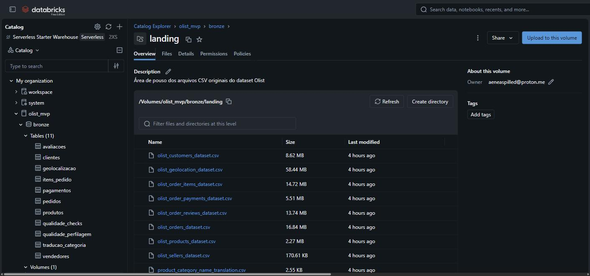

Contagem de linhas de cada tabela Bronze, saída do próprio notebook `01_ingestao_bronze` — os
mesmos números da tabela da seção 1.3:

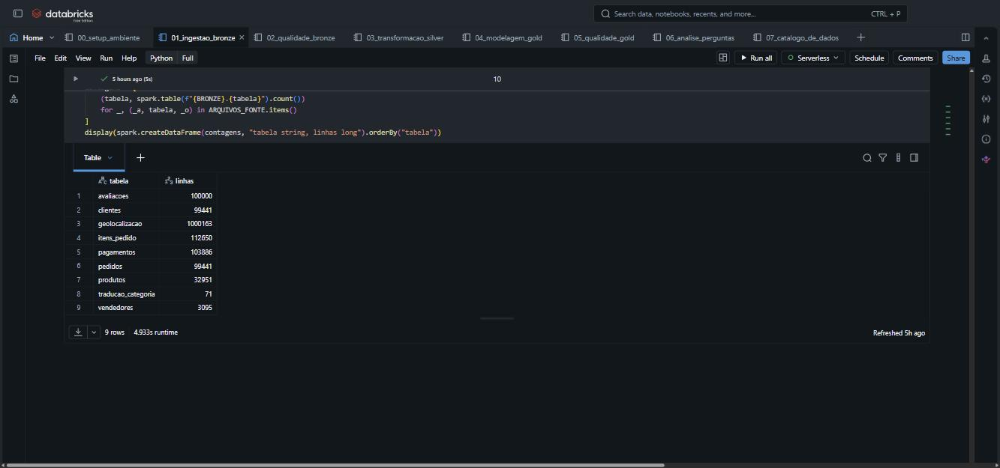

---

## 3. Modelagem e Catálogo de Dados (Etapa 4.3)

> Scripts: [`notebooks/04_modelagem_gold.py`](notebooks/04_modelagem_gold.py) ·
> [`notebooks/07_catalogo_de_dados.py`](notebooks/07_catalogo_de_dados.py)
> Catálogo completo: [`docs/catalogo_de_dados.md`](docs/catalogo_de_dados.md)

### 3.1 A arquitetura em camadas

```
  CSV públicos                BRONZE                    SILVER                      GOLD
 (Volume UC)          9 tabelas, tudo STRING    8 tabelas tipadas e limpas   esquema estrela
  1.551.698 linhas  →  fiel à origem + linhagem →  1 linha por entidade    →  2 fatos + 4 dimensões
                          (cofre)                   (dado confiável)           (pronto para consumo)
```

Cada camada é um schema do Unity Catalog dentro do catálogo `olist_mvp`, e o papel de cada uma é
distinto: a Bronze responde "o que chegou?", a Silver responde "o que é verdade?", a Gold responde
"o que o negócio pergunta?".

### 3.2 O esquema estrela

```
                        ┌──────────────┐          ┌──────────────┐
                        │   dim_data   │          │ dim_cliente  │
                        │  (800 dias)  │          │   (99.441)   │
                        └──────┬───────┘          └──────┬───────┘
                               │                         │
             ┌─────────────────┼─────────────────────────┼──────────────┐
             │                 │                         │              │
      ┌──────┴────────┐  ┌─────┴──────────────┐          │              │
      │  dim_produto  │  │ fato_item_pedido   │──────────┤              │
      │   (32.951)    ├──┤  grão: 1 item      │          │       ┌──────┴───────┐
      └───────────────┘  │  112.650 linhas    │          │       │ fato_pedido  │
                         └─────┬──────────────┘          └───────┤ grão: pedido │
                               │                                 │ 99.441 linhas│
                        ┌──────┴───────┐                         └──────────────┘
                        │ dim_vendedor │
                        │   (3.095)    │
                        └──────────────┘
```

**Por que dois fatos e não um.** Existem dois grãos legítimos neste negócio, e misturá-los produz
número errado. Preço e frete são atributos do **item**; prazo de entrega, nota da avaliação e forma
de pagamento são atributos do **pedido**. Se tudo fosse achatado numa tabela só, um pedido com três
itens contaria o mesmo atraso três vezes, e a média de nota por categoria ficaria enviesada em
favor dos pedidos grandes. Os dois fatos compartilham as mesmas dimensões (*conformed dimensions*),
o que permite cruzar os dois mundos sem duplicar a verdade.

| Tabela | Grão | Linhas | Para que serve |
|---|---|---:|---|
| `gold.fato_pedido` | um pedido | 99.441 | prazo, satisfação, pagamento, ticket |
| `gold.fato_item_pedido` | um item de um pedido | 112.650 | receita, frete, produto, vendedor, distância |
| `gold.dim_data` | um dia | 800 | recortes temporais (mês, trimestre, dia da semana) |
| `gold.dim_cliente` | uma chave de compra | 99.441 | geografia do comprador e recorrência da pessoa |
| `gold.dim_vendedor` | um vendedor | 3.095 | geografia do lojista |
| `gold.dim_produto` | um produto | 32.951 | categoria, peso, volume |

**Sobre as chaves.** As dimensões usam a **chave natural** do negócio (`pedido_id`, `produto_id`,
`vendedor_id`) em vez de chave substituta inteira. Num Lakehouse colunar não há ganho relevante em
trocar um hash de 32 caracteres por um inteiro — e manter a chave de origem preserva a linhagem até
a Bronze, permitindo auditar qualquer linha do fato até o CSV que a gerou. A exceção é `dim_data`,
que usa a convenção `yyyyMMdd` como inteiro. As chaves primárias e estrangeiras são **declaradas no
Unity Catalog** (`ADD CONSTRAINT ... PRIMARY KEY / FOREIGN KEY`): não são impostas na escrita, mas
documentam o relacionamento e alimentam o diagrama de modelo do Catalog Explorer.

**O enriquecimento que faz o modelo valer.** As duas dimensões geográficas recebem a coordenada do
CEP vinda de `silver.geolocalizacao`. Com vendedor e comprador posicionados no mapa, o fato de item
calcula a **distância Haversine** entre eles — uma coluna que não existe em nenhum dos nove arquivos
de origem e sem a qual a pergunta P5 não teria resposta. Foi calculada para 112.095 dos 112.650
itens (99,5%); os 555 restantes têm CEP sem coordenada na base.

### 3.3 Catálogo de dados

O catálogo tem **uma única fonte de verdade**: o dicionário `CATALOGO` no notebook
`07_catalogo_de_dados`. Dele saem três artefatos ao mesmo tempo:

1. **Comentários no Unity Catalog** — `COMMENT ON TABLE` e `ALTER COLUMN ... COMMENT` em todas as
   tabelas Silver e Gold, de modo que a descrição aparece no Catalog Explorer, no autocomplete do
   editor SQL e para qualquer ferramenta que leia o metastore.
2. **A tabela `gold.catalogo_de_dados`** — consultável por SQL, com camada, tabela, coluna, tipo,
   papel (chave primária / estrangeira / indicador / atributo) e descrição.
3. **O arquivo [`docs/catalogo_de_dados.md`](docs/catalogo_de_dados.md)** — versionado junto com o
   código.

Antes de gerar qualquer coisa, o notebook **valida o dicionário contra o schema real** das tabelas:
coluna criada e não documentada, ou documentada e inexistente, interrompe a execução. É o que
impede o catálogo de envelhecer em silêncio enquanto o pipeline evolui.

**Cobertura: 14 tabelas, 186 colunas documentadas.** Cada descrição traz o significado, o domínio de
valores (faixa para numéricos, categorias para textuais) e a origem/transformação. Exemplo de três
linhas reais do catálogo:

| Coluna | Tipo | Papel | Descrição e domínio |
|---|---|---|---|
| `dias_atraso` | `double` | atributo | Entrega real menos prazo prometido, em dias. Negativo = adiantado. |
| `meio_pagamento_principal` | `string` | atributo | Meio de pagamento da transação de maior valor do pedido. Domínio: credit_card, boleto, voucher, debit_card, not_defined. |
| `distancia_km` | `double` | atributo | Distância em linha reta (Haversine) entre o CEP do vendedor e o do cliente. Nula quando algum dos CEPs não tem coordenada. |

### 3.4 Evidências da modelagem e do catálogo

As seis tabelas da camada Gold no Catalog Explorer — repare que a coluna *Comment* já traz a
descrição de cada tabela, gravada pelo notebook `07`:

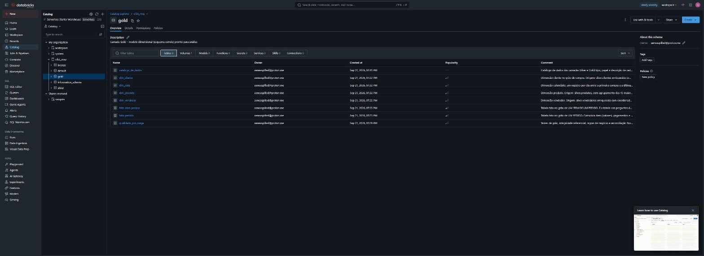

As oito tabelas da camada Silver, no mesmo catálogo:

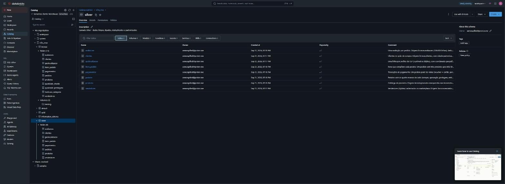

E o catálogo de dados **dentro** do Unity Catalog: `DESCRIBE TABLE EXTENDED gold.fato_pedido`
devolvendo tipo e descrição de cada uma das colunas do fato:

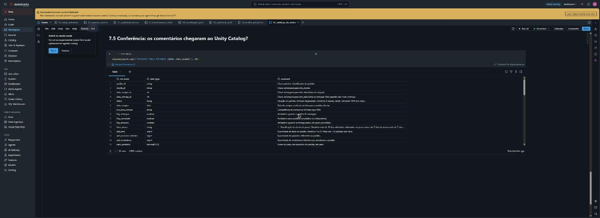

---

## 4. Pipeline de Dados (Etapa 4.4)

### 4.1 Organização

O pipeline foi **ramificado em sete notebooks**, um por responsabilidade, em vez de concentrado num
só. A razão é prática: quando a Silver quebra, não faz sentido reexecutar 60 segundos de perfilagem
da Bronze para chegar de novo no ponto do erro. Cada notebook tem entrada e saída explícitas e pode
ser reexecutado isoladamente.

| # | Notebook | O que faz | Lê de | Escreve em |
|---|---|---|---|---|
| — | [`_config.py`](notebooks/_config.py) | parâmetros e funções compartilhadas (`%run ./_config`) | — | — |
| 00 | [`00_setup_ambiente.py`](notebooks/00_setup_ambiente.py) | cria catálogo, 3 schemas e 2 volumes | — | Unity Catalog |
| 01 | [`01_ingestao_bronze.py`](notebooks/01_ingestao_bronze.py) | baixa os CSVs e carrega 9 tabelas cruas | fonte pública | `bronze.*` |
| 02 | [`02_qualidade_bronze.py`](notebooks/02_qualidade_bronze.py) | perfila e diagnostica (36 verificações) | `bronze.*` | `bronze.qualidade_*` |
| 03 | [`03_transformacao_silver.py`](notebooks/03_transformacao_silver.py) | limpa, tipa, deduplica, padroniza | `bronze.*` | `silver.*` |
| 04 | [`04_modelagem_gold.py`](notebooks/04_modelagem_gold.py) | monta o esquema estrela e as constraints | `silver.*` | `gold.*` |
| 05 | [`05_qualidade_gold.py`](notebooks/05_qualidade_gold.py) | 21 testes pós-carga + reconciliação | `bronze.*`, `gold.*` | `gold.qualidade_pos_carga` |
| 06 | [`06_analise_perguntas.py`](notebooks/06_analise_perguntas.py) | responde P1–P9 e gera os gráficos | `gold.*` | `gold.relatorios` |
| 07 | [`07_catalogo_de_dados.py`](notebooks/07_catalogo_de_dados.py) | documenta tudo no UC e exporta o catálogo | `silver.*`, `gold.*` | `gold.catalogo_de_dados` |

Ordem de execução: **00 → 01 → 02 → 03 → 04 → 05 → 06 → 07**.

### 4.2 As transformações e por que cada uma existe

**Bronze → Silver** (`03_transformacao_silver`)

| Transformação | Motivo | Impacto |
|---|---|---|
| Tipagem explícita de todas as colunas | a Bronze é toda texto; sem tipo não há cálculo de prazo nem soma de dinheiro | 8 tabelas |
| Colapso de `geolocalizacao` para 1 linha por CEP, pela **mediana** das coordenadas | a origem é tabela de observações, não de lugares; a mediana não se desloca com pontos absurdos, a média sim | 1.000.163 → 19.010 linhas |
| Descarte de coordenadas fora da caixa do território brasileiro | há pontos na Ásia e na América do Norte num dataset de CEPs brasileiros | 42 linhas |
| Deduplicação das avaliações, mantendo a **resposta mais recente** por pedido | a pergunta é "qual a nota daquele pedido"; o grão precisa ser o pedido | 100.000 → 99.441 |
| `normaliza_cidade()`: minúsculas, sem acento, sem sufixo de UF, sem resíduo de encoding | `sao paulo`, `são paulo`, `sãopaulo` e `sa£o paulo` são a mesma cidade; agrupar por cidade sem isso produz quatro linhas | todas as tabelas com cidade |
| Categoria ausente vira `nao_informado` em vez de `null` | esses 610 produtos venderam R$ 179.535; sumir com eles distorce a receita | 610 produtos |
| Tradução de categoria com *fallback* para o nome em português | 2 categorias não têm tradução cadastrada na origem | `pc_gamer`, `portateis_cozinha…` |
| `payment_installments = 0` → 1 | zero parcela não existe; a leitura correta é "à vista" | 2 transações |
| Correção do erro de grafia da fonte (`lenght` → `length`) | evita propagar o defeito para todo consumidor a jusante | 2 colunas |
| **Sinalização** (`flag_*`) em vez de descarte para registros inconsistentes | manter a linha e marcá-la deixa a decisão de incluir ou não para a camada de análise, de forma auditável | 1.359 + 8 + 6 + 3 casos |

**Silver → Gold** (`04_modelagem_gold`)

| Transformação | Motivo |
|---|---|
| Agregação dos itens por pedido (`qtd_itens`, `valor_produtos`, `valor_frete`, `valor_total`) | traz o valor para o grão de pedido sem perder o grão de item, que continua em `fato_item_pedido` |
| Agregação dos pagamentos por pedido + **meio principal** (o de maior valor) | um pedido pode combinar voucher e cartão; "o meio de pagamento do pedido" precisa de uma regra explícita |
| Junção da avaliação no fato de pedido | responder P1 sem *join* a cada consulta |
| Cálculo da **distância Haversine** vendedor ↔ cliente | variável que não existe na origem e sustenta a P5 |
| Geração da `dim_data` por sequência de datas | permite recortes temporais e expõe meses sem venda, que um `GROUP BY` sobre o fato esconderia |
| Agrupamento das 15 maiores categorias por receita, resto em `outras` | 74 categorias não cabem num gráfico legível; a categoria original permanece na tabela |
| Declaração de PK/FK no Unity Catalog | documenta o modelo e alimenta o diagrama do Catalog Explorer |

Exemplo concreto de junção documentada: `fato_item_pedido` é `silver.itens_pedido` enriquecida com
`silver.pedidos` (para herdar status e atraso do pedido ao qual o item pertence) e com
`dim_cliente`/`dim_vendedor` (para obter as coordenadas e derivar `distancia_km` e
`flag_interestadual`).

---

## 5. Qualidade de Dados (Etapa 4.5)

> Scripts: [`notebooks/02_qualidade_bronze.py`](notebooks/02_qualidade_bronze.py) (diagnóstico) ·
> [`notebooks/05_qualidade_gold.py`](notebooks/05_qualidade_gold.py) (testes pós-carga)

A qualidade foi tratada em dois momentos, que respondem a perguntas diferentes: **o que entrou
estava bom?** e **o que saiu está correto?** Um pipeline pode partir de uma base limpa e ainda
produzir número errado, por um *join* que duplicou linhas ou um filtro que comeu registros.

### 5.1 Diagnóstico sobre a Bronze

Duas tabelas de evidência são produzidas e persistidas: `bronze.qualidade_perfilagem` (uma linha por
coluna: vazios, cardinalidade, mínimo e máximo — 52 colunas perfiladas) e `bronze.qualidade_checks`
(**36 verificações dirigidas**, das quais **24 acusaram problema**).

Resumo por dimensão de qualidade:

| Dimensão | Verificações | Com problema | Ocorrências |
|---|---:|---:|---:|
| Unicidade | 8 | 3 | 263.188 |
| Consistência | 7 | 6 | 1.397 |
| Integridade referencial | 8 | 4 | 1.056 |
| Completude | 4 | 4 | 780 |
| Acurácia | 6 | 4 | 436 |
| Outliers | 3 | 3 | 270 |

### 5.2 Cada problema encontrado e o que foi feito com ele

| Dimensão | Problema | Ocorrências | Tratamento |
|---|---|---:|---|
| Unicidade | Linhas inteiramente duplicadas em `geolocation` | 261.831 | Colapso para 1 linha por CEP com mediana das coordenadas |
| Unicidade | `review_id` repetido em linhas diferentes | 802 | Mantido — é o mesmo id reaproveitado em pedidos distintos; a chave real da Silver passa a ser `pedido_id` |
| Unicidade | Pedido com mais de uma avaliação | 555 | Mantida a avaliação **respondida por último**; as demais descartadas, com `flag_pedido_reavaliado` marcando o caso |
| Consistência | Postagem à transportadora anterior à aprovação do pagamento | 1.359 | Mantidos, sinalizados por `flag_sequencia_datas_invalida`. Não é possível saber qual das duas datas está errada; descartar 1,4% dos pedidos por isso seria pior do que marcá-los |
| Consistência | Pedido **não** entregue com data de entrega preenchida | 6 | Sinalizado por `flag_nao_entregue_com_data`; excluído dos recortes de prazo, que filtram por `flag_entregue` |
| Consistência | `payment_type = 'not_defined'` | 3 | Mantido com `flag_meio_indefinido`; todos têm valor zero e não afetam receita |
| Consistência | `seller_city` com barra, sufixo de UF ou número | 24 + 1 | `normaliza_cidade()` remove o sufixo; o caso numérico fica marcado por `flag_cidade_invalida` |
| Consistência | 4 grafias distintas para "são paulo" em `geolocation` | 4 | Normalização de acento, caixa e encoding |
| Integridade | Pedido sem nenhum item | 775 | Mantido no fato com medidas nulas — são pedidos cancelados/indisponíveis, e sumir com eles esconderia o cancelamento |
| Integridade | Pedido sem nenhum pagamento | 1 | Mantido, medida de pagamento nula |
| Integridade | Categoria de produto sem tradução | 2 | *Fallback* para o nome em português |
| Integridade | CEP de cliente/vendedor sem coordenada | 278 + 7 | `latitude`/`longitude` nulas e `flag_sem_coordenada`; afeta 0,5% dos itens no cálculo de distância |
| Completude | Pedido entregue sem data de entrega | 8 | Mantido, `flag_entregue_sem_data`; excluído das métricas de prazo |
| Completude | Pedido sem data de aprovação | 160 | Mantido; `horas_ate_aprovacao` fica nula |
| Completude | Produto sem categoria | 610 | Categoria vira `nao_informado` (venderam R$ 179.535 — não podem sumir) |
| Completude | Produto sem peso/dimensões | 2 | Mantido; `volume_cm3` nulo e `flag_dimensoes_ausentes` |
| Acurácia | Coordenada fora do território brasileiro | 42 | Descartada antes do cálculo da mediana |
| Acurácia | `payment_value <= 0` | 9 | Mantido com `flag_valor_nulo` |
| Acurácia | `payment_installments = 0` | 2 | Normalizado para 1 |
| Acurácia | Frete igual a zero | 383 | Mantido — é promoção legítima, não erro; marcado por `flag_frete_gratis` |
| Outliers | Preço de item acima de R$ 2.000 | 123 | **Mantidos.** São vendas reais (o máximo é R$ 6.735). Nas análises sensíveis a cauda, usa-se mediana e percentil ao lado da média |
| Outliers | Frete acima de R$ 200 | 70 | Mantidos, mesma justificativa |
| Outliers | Entrega com mais de 90 dias | 77 | Mantidos — são exatamente o fenômeno que a P1 investiga; removê-los apagaria a evidência |

**O princípio que orientou as decisões:** nada é silenciosamente jogado fora. Linha problemática que
ainda tem valor analítico permanece com uma coluna-bandeira `flag_*`, e a decisão de incluí-la ou
não em cada métrica é tomada — explicitamente e por escrito — na camada de análise. O único descarte
real foram as 42 coordenadas impossíveis e as avaliações redundantes do mesmo pedido.

### 5.3 Testes pós-carga: o dado que saiu está correto?

O notebook `05_qualidade_gold` roda **21 testes** e grava o resultado em `gold.qualidade_pos_carga`.
**Os 21 passaram.**

| Família | O que verifica | Testes |
|---|---|---:|
| Grão | cada fato e dimensão tem a chave única que promete ter | 6 |
| Integridade referencial | todo fato encontra sua dimensão (0 órfãos) | 5 |
| Regras de negócio | nota na escala 1–5, valores não negativos, entregue tem prazo | 4 |
| **Reconciliação Bronze → Gold** | contagens e **somas financeiras** batem entre as pontas | 6 |

A reconciliação é o teste mais importante do conjunto: a receita de produtos e o valor de frete da
Bronze conferem com os da Gold **ao centavo** (diferença de 0 centavos em R$ 13.591.643,70 de
produtos e R$ 2.251.909,54 de frete). Se divergissem, alguma transformação teria perdido ou
duplicado dinheiro, e nenhuma análise adiante valeria nada.

### 5.3.1 Evidências

As 36 verificações sobre a Bronze, ordenadas por número de ocorrências — a coluna `situacao`
separa o que precisa de tratamento do que já está limpo:

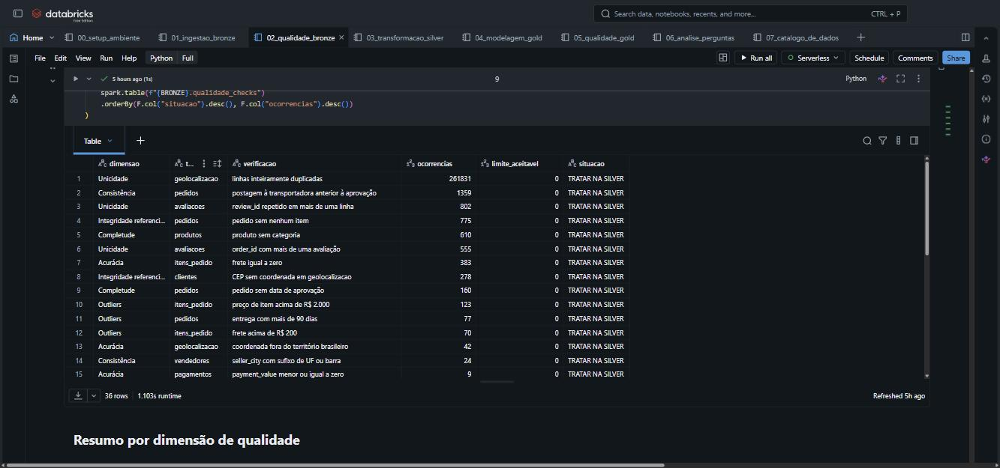

Os 21 testes pós-carga e o veredito final:

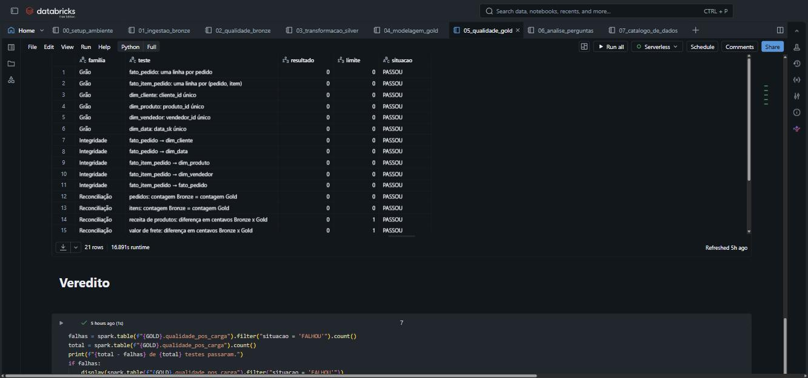

### 5.4 Cobertura: quanto da base sustenta cada resposta

| Recorte | Pedidos | % |
|---|---:|---:|
| Pedidos totais | 99.441 | 100,0% |
| Com nota de avaliação | 99.441 | 100,0% |
| Com distância vendedor–cliente calculada | 98.176 | 98,7% |
| Entregues | 96.478 | 97,0% |
| Entregues com data de entrega registrada | 96.470 | 97,0% |
| **Entregues + nota** (base das perguntas de prazo × satisfação) | **96.470** | **97,0%** |

Toda afirmação sobre prazo e satisfação neste documento vale para esses 96.470 pedidos, não para os
99.441 — e a diferença está declarada acima.

---

## 6. Análise de Dados (Etapa 4.5)

> Script: [`notebooks/06_analise_perguntas.py`](notebooks/06_analise_perguntas.py) ·
> As mesmas consultas em SQL puro: [`sql/consultas_analise.sql`](sql/consultas_analise.sql)

Todas as consultas rodam **exclusivamente sobre a camada Gold** — nenhuma faz *join* com Bronze ou
Silver. Se o modelo dimensional foi bem construído, ele basta; esse é o teste final do pipeline.

### P1 · O atraso derruba a nota? Em que intensidade?

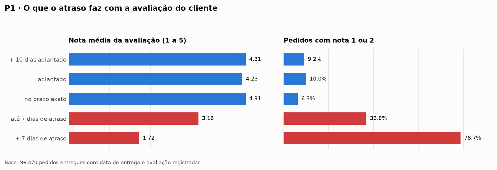

| Faixa de atraso | Pedidos | % | Nota média | % nota 1–2 | % nota 5 |
|---|---:|---:|---:|---:|---:|
| mais de 10 dias adiantado | 57.225 | 59,3% | 4,31 | 9,2% | 63,8% |
| adiantado | 31.409 | 32,6% | 4,23 | 10,0% | 59,2% |
| no prazo exato | 16 | 0,0% | 4,31 | 6,3% | 62,5% |
| **até 7 dias de atraso** | 4.478 | 4,6% | **3,16** | **36,8%** | 32,7% |
| **mais de 7 dias de atraso** | 3.342 | 3,5% | **1,72** | **78,7%** | 7,3% |

**Resposta.** Sim, e de forma brutalmente não linear. O pedido entregue no prazo tem nota média
**4,28**; o atrasado, **2,54** — uma queda de 1,74 ponto numa escala de cinco. Mas a média esconde o
essencial: **existe um limiar por volta de uma semana.** Até 7 dias de atraso, a nota cai para 3,16
e 36,8% dos clientes dão 1 ou 2. Passando de 7 dias, a nota desaba para **1,72 e quase quatro em
cada cinco clientes (78,7%) dão a nota mínima**. A correlação de Pearson entre dias de atraso e nota
é **-0,269**; entre tempo total de entrega e nota, **-0,335** — moderadas, como se espera de uma
variável ordinal de cinco níveis, mas consistentes em sinal e magnitude.

**O que isso significa para o negócio.** Atrasar não é uma degradação suave da experiência: é um
penhasco. Uma semana é o tempo que a paciência do cliente compra. E o inverso também aparece: chegar
*muito* adiantado (mais de 10 dias) rende 4,31 contra 4,23 de quem chega apenas adiantado — uma
diferença pequena, o que sugere que **antecipar a entrega tem retorno marginal decrescente, enquanto
atrasar tem custo explosivo.** A assimetria justifica prazo conservador.

Execução da consulta na plataforma (P1.b e P1.c, respostas idênticas às tabelas acima):

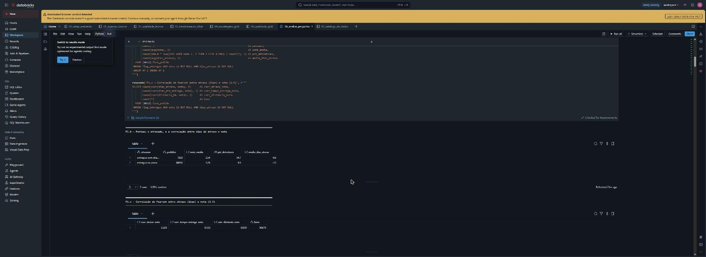

### P2 · Onde o tempo é perdido?

| Recorte | Pedidos | Horas até aprovar | Dias até postar | Dias em transporte | Total |
|---|---:|---:|---:|---:|---:|
| Todos os entregues | 96.470 | 10,3 | 2,80 | 9,33 | **12,56** |
| Entregues no prazo | 88.650 | 10,1 | 2,58 | 7,89 | **10,89** |
| Entregues com atraso | 7.820 | 12,3 | **5,32** | **25,69** | **31,53** |

Mediana do ciclo total: 10,22 dias; percentil 90: 23,09 dias.

**Resposta.** O transporte é onde o tempo mora e onde ele se perde. Num pedido pontual, o ciclo é
10,9 dias: 10 horas para aprovar o pagamento, 2,6 dias para o lojista postar, 7,9 dias na estrada.
Num pedido atrasado, o ciclo triplica para 31,5 dias — e a decomposição mostra que **o transporte
sozinho responde por 17,8 dos 20,6 dias adicionais (86%)**, contra 2,7 dias de atraso extra do
lojista.

**O que isso significa.** A aprovação de pagamento é irrelevante para o problema (10 a 12 horas em
ambos os casos). O manuseio do lojista **dobra** nos pedidos atrasados (2,58 → 5,32 dias), o que é
um sinal real — mas o transporte **triplica** (7,89 → 25,69). Um programa de melhoria que só
cobrasse agilidade do lojista atacaria 13% do problema. A alavanca está na malha logística e, como
a P5 mostra, na distância que ela precisa vencer.

### P3 · O prazo prometido é conservador?

| Pedidos | Prazo prometido | Entrega real | Folga média | Folga mediana | Dentro do prazo |
|---:|---:|---:|---:|---:|---:|
| 96.470 | 23,7 dias | 12,6 dias | **11,2 dias** | 11,9 dias | **91,9%** |

Por região do cliente:

| Região | Pedidos | Prazo prometido | Entrega real | Folga | % atrasados |
|---|---:|---:|---:|---:|---:|
| Norte | 1.796 | 37,5 | 22,6 | **14,9** | 9,8% |
| Sul | 13.813 | 26,4 | 14,0 | 12,4 | 7,0% |
| Centro-Oeste | 5.624 | 26,7 | 15,0 | 11,6 | 7,9% |
| Sudeste | 66.193 | 21,6 | 10,8 | 10,9 | 7,4% |
| Nordeste | 9.044 | 30,7 | 20,0 | **10,6** | **14,3%** |

**Resposta.** Muito conservador. A Olist promete 23,7 dias e entrega em 12,6: embute **11,2 dias de
folga**, quase **90% de gordura** sobre o tempo que efetivamente leva. O resultado é que 91,9% dos
pedidos chegam dentro do prazo — uma taxa excelente que, em boa medida, é comprada com uma promessa
generosa, não só com eficiência operacional.

**O que isso significa.** Há espaço evidente para encurtar prazos e ganhar conversão no checkout —
mas não uniformemente. O cruzamento por região mostra onde o colchão está mal distribuído: o
**Nordeste tem a menor folga (10,6 dias) e a maior taxa de atraso (14,3%)**, quase o dobro do
Sudeste. Ou seja, a região com a operação menos previsível é justamente a que recebe a promessa
proporcionalmente mais apertada. O Norte é o oposto: 14,9 dias de folga e só 9,8% de atraso, ao
custo de prometer 37,5 dias ao cliente. **A recomendação que sai daí não é "encurtar o prazo", é
"redistribuir a folga"** — apertar no Sudeste, onde a operação é previsível, e afrouxar no Nordeste,
onde não é.

### P4 · O país inteiro recebe o mesmo serviço?

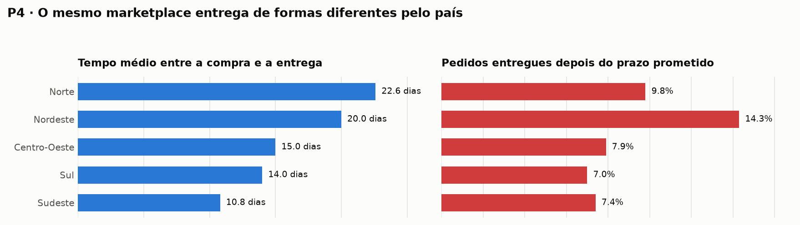

| Região | Pedidos | Dias até entregar | % atrasados | Nota média | Frete médio | Distância média |
|---|---:|---:|---:|---:|---:|---:|
| Nordeste | 9.044 | 20,0 | **14,3%** | **3,95** | R$ 35,99 | 1.782 km |
| Norte | 1.796 | **22,6** | 9,8% | 4,02 | R$ 41,35 | 2.233 km |
| Centro-Oeste | 5.624 | 15,0 | 7,9% | 4,12 | R$ 26,49 | 900 km |
| Sul | 13.813 | 14,0 | 7,0% | 4,18 | R$ 24,35 | 654 km |
| Sudeste | 66.193 | **10,8** | 7,4% | **4,17** | R$ 19,84 | 359 km |

**Resposta.** Não. Um cliente do Norte espera **22,6 dias**; um do Sudeste, **10,8** — mais que o
dobro. No extremo por UF, São Paulo recebe em **8,8 dias** e Alagoas em **24,5**, com 23,9% de
atraso. A nota acompanha: 4,17 no Sudeste contra 3,95 no Nordeste.

**O que isso significa.** Vale notar uma sutileza: o **Norte demora mais mas atrasa menos** (9,8%)
que o **Nordeste** (14,3%). Não é contradição — é a P3 aparecendo de novo. O Norte recebe uma
promessa tão folgada (37,5 dias) que a operação lenta ainda cabe dentro dela. O Nordeste recebe
promessa apertada para uma operação instável, e quebra. **Para o cliente, o que dói não é a
lentidão: é a surpresa.** O Amazonas é o caso extremo dessa lógica: 26,4 dias para entregar, o pior
prazo do país, e mesmo assim apenas 4,1% de atraso e nota 4,23 — acima da média nacional.

### P5 · O que explica o custo do frete?

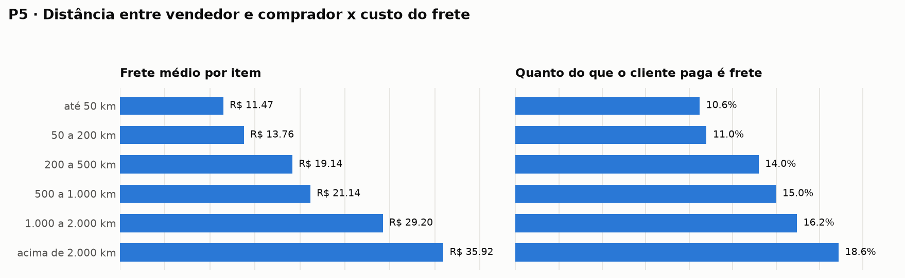

| Faixa de distância | Itens | Frete médio | % do que o cliente paga |
|---|---:|---:|---:|
| até 50 km | 13.823 | R$ 11,47 | 10,6% |
| 50 a 200 km | 15.036 | R$ 13,76 | 11,0% |
| 200 a 500 km | 35.457 | R$ 19,14 | 14,0% |
| 500 a 1.000 km | 30.099 | R$ 21,14 | 15,0% |
| 1.000 a 2.000 km | 11.254 | R$ 29,20 | 16,2% |
| acima de 2.000 km | 6.426 | **R$ 35,92** | **18,6%** |

Correlações (112.077 itens): **peso 0,612** · **volume 0,587** · valor do produto 0,415 ·
**distância 0,390**.
Item interestadual: R$ 23,69 de frete (15,4% do total); dentro do mesmo estado: R$ 13,46 (11,4%).

**Resposta.** O frete triplica da faixa mais curta para a mais longa, e sua participação no bolso do
cliente sobe de 10,6% para 18,6%. Mas a correlação diz que **a distância não é o fator dominante: o
peso é** (0,612 contra 0,390). Distância e peso são duas alavancas independentes, e a mais forte é a
física do pacote, não a geografia.

**O que isso significa — e a explicação estrutural.** O dado que fecha o raciocínio não está nesta
tabela: **71,3% de todos os itens vendidos saem de vendedores de São Paulo**. A concentração da
oferta no Sudeste é o que transforma "comprar no marketplace" em "receber uma encomenda de longe"
para todo mundo que não mora ali. O cliente do Norte paga R$ 41,35 de frete e 18,5% do valor do
pedido não porque escolheu um vendedor distante, mas porque **não havia vendedor perto**. A
consequência operacional: a alavanca mais barata para reduzir frete no Norte e Nordeste não é
negociar tabela com transportadora — é **captar lojistas nessas regiões**. E, dado que o peso pesa
mais que a distância, a segunda alavanca é trabalhar embalagem e mix nas categorias pesadas.

### P6 · Categorias: receita e insatisfação

As 15 maiores por receita (de R$ 13,59 milhões no total):

| Categoria | Itens | Receita | % | Ticket | Nota | % atraso |
|---|---:|---:|---:|---:|---:|---:|
| beleza_saude | 9.670 | R$ 1.258.681 | 9,3% | R$ 130,16 | 4,12 | 8,9% |
| relogios_presentes | 5.991 | R$ 1.205.006 | 8,9% | R$ 201,14 | 4,00 | 8,1% |
| **cama_mesa_banho** | 11.115 | R$ 1.036.989 | 7,6% | R$ 93,30 | **3,87** | 8,3% |
| esporte_lazer | 8.641 | R$ 988.049 | 7,3% | R$ 114,34 | 4,09 | 7,2% |
| **informatica_acessorios** | 7.827 | R$ 911.954 | 6,7% | R$ 116,51 | **3,92** | 7,6% |
| **moveis_decoracao** | 8.334 | R$ 729.762 | 5,4% | R$ 87,56 | **3,89** | 8,3% |
| cool_stuff | 3.796 | R$ 635.291 | 4,7% | R$ 167,36 | 4,13 | 6,6% |
| utilidades_domesticas | 6.964 | R$ 632.249 | 4,7% | R$ 90,79 | 4,04 | 6,3% |
| automotivo | 4.235 | R$ 592.720 | 4,4% | R$ 139,96 | 4,04 | 8,1% |
| ferramentas_jardim | 4.347 | R$ 485.256 | 3,6% | R$ 111,63 | 4,03 | 7,8% |

Piores notas entre categorias relevantes (≥ 500 itens):

| Categoria | Itens | Receita | Nota | % detratores | % atraso |
|---|---:|---:|---:|---:|---:|
| moveis_escritorio | 1.691 | R$ 273.961 | **3,48** | **26,3%** | 8,8% |
| nao_informado | 1.603 | R$ 179.535 | 3,82 | 22,7% | 9,0% |
| cama_mesa_banho | 11.115 | R$ 1.036.989 | 3,87 | 19,5% | 8,3% |
| moveis_sala | 503 | R$ 68.917 | 3,88 | 18,5% | 7,8% |
| moveis_decoracao | 8.334 | R$ 729.762 | 3,89 | 19,8% | 8,3% |

**Resposta.** Sim, existe — e é justamente onde mais dói. **`cama_mesa_banho` é a terceira maior
fonte de receita (R$ 1,04 milhão, 7,6%) e ao mesmo tempo a terceira pior nota entre as categorias
relevantes (3,87, com 19,5% de detratores).** `moveis_decoracao` repete o padrão: 5,4% da receita com
nota 3,89. E `moveis_escritorio` tem a pior nota do catálogo, 3,48, com mais de um quarto dos
clientes dando 1 ou 2.

**O que isso significa.** O padrão não é aleatório: as piores notas se concentram em **móveis e
cama/mesa/banho** — produtos volumosos, de montagem ou de expectativa estética forte, onde o
produto entregue pode divergir da foto. E a pontualidade **não** explica a diferença: essas
categorias atrasam 8,3–8,8%, praticamente a média geral (8,1%). Ou seja, aqui a insatisfação **não é
logística** — é do produto ou da descrição do anúncio. É o achado que mais contraria a tese central
deste trabalho, e por isso o mais útil: mostra que existe uma segunda fonte de nota baixa,
independente da entrega, que um projeto focado só em prazo deixaria passar.

### P7 · Concentração da receita entre vendedores

| Faixa | Vendedores acumulados | % dos 3.095 vendedores |
|---|---:|---:|
| 50% da receita | 129 | **4,2%** |
| 80% da receita | 543 | 17,5% |
| 90% da receita | 911 | 29,4% |

**Resposta.** Extremamente concentrada, além do que a regra de Pareto prevê. **129 vendedores —
4,2% da base — respondem por metade de toda a receita**; 543 (17,5%) respondem por 80%. Os 2.184
vendedores da cauda, 70% do cadastro, somam os últimos 10%.

**O que isso significa.** É risco de concentração clássico: a saída dos dez maiores lojistas tiraria
uma fatia material do faturamento. E, cruzando com a operação, aparece um caso digno de atenção: o
quinto maior vendedor em receita (R$ 187.924) leva **11,6 dias** para postar, contra 1,6 a 2,4 dias
dos demais gigantes, e tem a pior nota do grupo (**3,34**). Um único lojista relevante operando mal
contamina a percepção da marca numa escala que um lojista pequeno jamais alcançaria — o que sugere
que gestão de qualidade de vendedor deveria ser ponderada por volume, não uniforme.

### P8 · Pagamento e parcelamento

| Meio | Pedidos | % | Ticket médio | Parcelas médias | Nota |
|---|---:|---:|---:|---:|---:|
| credit_card | 74.975 | 75,4% | R$ 166,95 | 3,55 | 4,07 |
| boleto | 19.784 | 19,9% | R$ 144,91 | 1,00 | 4,07 |
| voucher | 3.151 | 3,2% | R$ 115,25 | 1,14 | 3,98 |
| debit_card | 1.527 | 1,5% | R$ 141,52 | 1,00 | 4,16 |

| Parcelamento | Pedidos | Ticket médio | Nota |
|---|---:|---:|---:|
| à vista | 48.270 | R$ 120,56 | 4,10 |
| 2 a 3× | 22.792 | R$ 136,03 | 4,07 |
| 4 a 6× | 16.205 | R$ 182,63 | 4,05 |
| 7 a 10× | 11.832 | **R$ 334,97** | 3,98 |
| 11× ou mais | 341 | **R$ 359,36** | **3,84** |

**Resposta.** O parcelamento acompanha o ticket de forma quase monotônica: **R$ 120,56 à vista
contra R$ 359,36 em 11 ou mais parcelas — praticamente o triplo.** O cartão domina o checkout com
75,4% dos pedidos; o boleto, com 19,9%, é sempre à vista e tem ticket 13% menor.

**O que isso significa.** O crédito parcelado é o que viabiliza o pedido grande — a relação é forte
demais para ser coincidência. Mas há um contraponto: **a nota cai conforme o parcelamento sobe**
(4,10 → 3,84). Duas leituras cabem, e o dataset não permite escolher entre elas: ou o cliente que
gasta mais é mais exigente, ou o pedido caro é mais volumoso e sofre mais na entrega. Distinguir as
duas exigiria dados de peso por pedido cruzados com expectativa — fica registrado como limitação.

### P9 · O atraso afasta o cliente?

| Situação do 1º pedido | Clientes | Voltaram a comprar | Taxa de recompra |
|---|---:|---:|---:|
| primeiro pedido no prazo | 85.753 | 2.611 | **3,04%** |
| primeiro pedido atrasou | 7.597 | 190 | **2,50%** |

Recorrência na base: 2.997 de 96.096 pessoas (**3,12%**).

**Resposta — parcial, e esta é a pergunta que o dataset não permite fechar.** A direção é a
esperada: quem teve o primeiro pedido atrasado volta menos (2,50% contra 3,04%), uma queda relativa
de 18%. Mas a base é frágil demais para sustentar a conclusão. **Apenas 3,12% das pessoas compram
mais de uma vez** em toda a janela, e a janela tem apenas 25 meses com **censura à direita**: quem
comprou em outubro de 2018 não teve tempo de voltar antes de o dataset terminar. Os 190 clientes
que recompraram após um atraso são poucos para descartar o acaso, e não há como separar "não voltou
porque ficou insatisfeito" de "não voltou ainda".

**O que isso significa.** O honesto é dizer que **o sinal existe e aponta na direção esperada, mas o
dado não sustenta uma afirmação causal.** Responder isso direito exigiria um horizonte de observação
maior e uma coorte com tempo de exposição controlado.

### Discussão geral: juntando as respostas

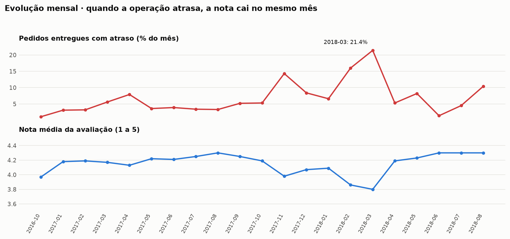

O problema que abriu este trabalho era uma promessa: a Olist controla a data que aparece no
checkout, não o caminhão. As nove respostas montam uma cadeia causal coerente, e a série mensal a
confirma no tempo — **as duas curvas são espelhos**. Em novembro de 2017 (Black Friday) o atraso
salta para 14,3% e a nota cai para 3,98. Em março de 2018 o atraso chega a **21,4%** e a nota ao
mínimo da série, **3,80**. Quando a operação se recompõe em junho de 2018 (1,4% de atraso), a nota
volta a 4,30. Não há defasagem: **a insatisfação chega no mesmo mês em que a operação falha.**

A cadeia completa:

**A oferta é concentrada** (71,3% dos itens saem de SP, 4,2% dos vendedores fazem metade da receita)
→ **isso impõe distância a quem não é do Sudeste** (2.233 km no Norte contra 359 km no Sudeste) →
**a distância encarece o frete e alonga o transporte** (R$ 41,35 e 22,6 dias no Norte) → **o
transporte é 86% do tempo perdido quando algo dá errado** → **e a nota desaba quando o atraso passa
de uma semana** (1,72, com 78,7% de notas mínimas).

Três conclusões práticas saem disso:

1. **A promessa está mal distribuída, não mal calibrada.** Há 11,2 dias de folga média, mas o
   Nordeste — a operação menos previsível — recebe a menor folga (10,6 dias) e atrasa mais (14,3%).
   Redistribuir o colchão existente melhora a pontualidade sem prometer nada pior ao cliente.
2. **A alavanca estrutural do frete é a malha de vendedores, não a tabela de frete.** Com 71,3% da
   oferta em São Paulo, a distância é consequência da composição do catálogo. E como o peso
   correlaciona mais com o frete (0,612) do que a distância (0,390), embalagem e mix de produto são
   a segunda alavanca.
3. **Nem toda nota baixa é culpa da entrega.** `cama_mesa_banho` e a família de móveis combinam
   receita alta com nota baixa **sem atrasar mais que a média**. Existe uma segunda fonte de
   insatisfação — produto ou descrição do anúncio — que um programa focado só em logística não
   alcançaria.

---

## 7. Autoavaliação

### O que eu me propus a fazer, e o que consegui

O objetivo traçado antes da coleta era construir um pipeline de ponta a ponta na nuvem que ligasse
promessa de entrega, satisfação e custo de frete, e responder nove perguntas. **Oito das nove foram
respondidas com evidência suficiente para sustentar uma recomendação de negócio.** A P9 (efeito do
atraso sobre a recompra) foi respondida apenas em direção, não em magnitude — e a razão é do dado,
não do pipeline: com 3,12% de recorrência numa janela de 25 meses com censura à direita, nenhum
tratamento salvaria a análise. Mantive a pergunta no documento, como a especificação pede, porque
descobrir que uma pergunta não é respondível com o dado disponível também é um resultado.

A parte de engenharia atingiu o que eu queria: as camadas têm papéis distintos e defensáveis, os
dois grãos estão separados em dois fatos, a reconciliação financeira Bronze↔Gold fecha ao centavo, e
o catálogo de 186 colunas é validado contra o schema real a cada execução — não é um documento que
envelhece.

### O que foi difícil

**A decisão de grão foi a mais cara do trabalho.** A saída óbvia é uma tabela grande só, no grão de
item, com o atraso e a nota replicados em cada linha — e ela funciona, no sentido de rodar sem erro.
Só que produz número errado em silêncio: num pedido de três itens, o mesmo atraso entra três vezes,
e a nota média por categoria passa a pesar mais os pedidos grandes. O que me convenceu a separar em
dois fatos foi justamente perceber que a mesma métrica dava valores diferentes contada por item e
contada por pedido — sem aviso nenhum do Spark. Separar custou uma tabela a mais e um pouco de
redundância; o ganho é que cada pergunta é respondida no grão em que ela faz sentido.

**A tabela de geolocalização quase inviabilizou o cálculo de distância.** São 1.000.163 linhas para
19.015 CEPs: um join direto com o fato multiplicaria as linhas por ~50 e o cálculo não terminaria em
tempo razoável. Entender que aquilo é uma tabela de *observações de GPS* e não de *lugares* — e que
a agregação certa é a **mediana**, não a média, porque 42 coordenadas caem na Ásia e na América do
Norte e arrastariam qualquer média — foi o que destravou a `distancia_km`, que acabou sendo a
variável mais informativa que criei e a única resposta possível para a P5.

**A disciplina de não limpar demais exigiu mais esforço do que limpar.** Diante de 1.359 pedidos com
datas fora de ordem, 123 itens acima de R$ 2.000 e 77 entregas de mais de 90 dias, a saída rápida é
filtrar tudo e seguir com uma base bonita. Foi preciso parar caso a caso e perguntar se a linha tem
valor analítico — e, no caso das entregas de 90 dias, a resposta é que elas **são** o fenômeno que a
P1 investiga; removê-las apagaria a evidência. A regra que adotei (sinalizar com `flag_*` em vez de
descartar, e declarar a inclusão em cada análise) deu mais trabalho e é o que permite auditar
qualquer número deste documento até o CSV de origem.

**Erros que só apareceram na conferência.** A primeira versão da consulta de Pareto (P7) usava
`min()` sobre a posição acumulada em vez de `max()`, e reportava que *um único vendedor* fazia 50%
da receita — um número absurdo o bastante para saltar aos olhos. Foi o lembrete mais útil do
trabalho: consulta que roda sem erro não é consulta correta, e a defesa contra isso é olhar para o
resultado perguntando se ele é plausível, não se o SQL compilou.

### O que eu faria diferente e o que viria depois

- **Automação.** O pipeline hoje roda por execução manual dos notebooks na ordem. O passo natural é
  orquestrá-lo como um Databricks Job com dependências entre tarefas, e trocar a carga *full
  overwrite* por carga incremental com Auto Loader — o que exigiria repensar a idempotência que hoje
  vem de graça do `overwrite`.
- **Qualidade como contrato, não como relatório.** Os 21 testes pós-carga hoje registram o
  resultado; deveriam **interromper** o pipeline e impedir a publicação da Gold quando a
  reconciliação falha. Expectativas declarativas (Delta Live Tables ou Great Expectations) fariam
  isso melhor do que as minhas consultas.
- **Enriquecimento externo.** A análise pede duas fontes que o dataset não tem: dados de renda e
  densidade populacional por CEP (IBGE) para separar efeito geográfico de efeito socioeconômico, e
  calendário de feriados e datas comerciais para explicar os picos de novembro e março, que hoje eu
  apenas constato.
- **A pergunta que ficou.** Quantificar o efeito do atraso sobre a receita futura do cliente exige
  um horizonte maior e uma coorte com tempo de exposição controlado. É o trabalho que eu faria em
  seguida, e o único item da lista original que continua em aberto.

### Sobre o uso de IA neste trabalho

Usei um assistente de IA como par de programação durante a construção: para acelerar a escrita de
código repetitivo (as descrições do catálogo, as variações das consultas de agregação), para revisar
decisões de modelagem e para encontrar erros — foi assim, por exemplo, que o viés do grão único
apareceu. As decisões de escopo, o recorte do problema, a formulação das perguntas, a escolha do
modelo dimensional e a interpretação dos resultados são minhas, e todo número deste documento saiu
da execução do pipeline, não de estimativa.

---

## Como reproduzir

1. Crie uma conta no [Databricks Free Edition](https://www.databricks.com/learn/free-edition).
2. Importe a pasta `notebooks/` no workspace (*Workspace → Import*) ou conecte este repositório via
   *Git folder*.
3. Execute na ordem: `00` → `01` → `02` → `03` → `04` → `05` → `06` → `07`.
   O notebook `01` baixa os dados sozinho; não é preciso subir arquivo nenhum.
4. Para rodar em outro catálogo, altere `CATALOG` em `notebooks/_config.py`.

Tempo total de execução em serverless: poucos minutos. O pipeline é idempotente — pode ser
reexecutado do zero quantas vezes for preciso.

---

## Créditos e licença

Dados: **Olist**, *Brazilian E-Commerce Public Dataset*, licença
[CC BY-NC-SA 4.0](https://creativecommons.org/licenses/by-nc-sa/4.0/).
Código e documentação deste repositório: mesma licença, uso acadêmico e não comercial.
